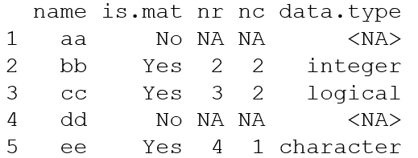

```{r setup, include=FALSE}
knitr::opts_chunk$set(echo = TRUE)
```

###Module 6 Exercise

- Design a for loop which analyzes a list of various data types and characterizes the elements in a data frame

- Sample data:
  - aa=c(3.4,1)
  - bb=matrix(1:4,2,2), 
  - cc=matrix(c(T,T,F,T,F,F),3,2),
  - dd="string here",  
  - ee=matrix(c("red","green","blue","yellow"))

- Preallocate the data frame elements where possible

- Output:



```{r}
# Module 6 Exercise

# create the list
foo <- list(aa=c(3.4,1), bb=matrix(1:4,2,2), 
            cc=matrix(c(T,T,F,T,F,F),3,2),
            dd="string here",  
            ee=matrix(c("red","green","blue","yellow")))

# Obtain preliminary information and preallocate

name <- names(foo)             # get element names
is.mat <- rep(NA,length(foo))  # preallocate for testing for matrices
nr <- is.mat                   # preallocate for number of rows
nc <- is.mat                   # preallocate for number of columns
data.type <- is.mat            # preallocate for data type of each

# loop implementation
for (i in 1:length(foo)) {
      member <- foo[[i]]
      if(is.matrix(member)) {
              is.mat[i] <- "Yes"
              nr[i] <- nrow(member)
              nc[i] <- ncol(member)
              data.type[i] <- class(as.vector(member))
    } else {
        is.mat[i] <- "No"
    }
}

# create a data frame from the collected data items
bar <- data.frame(name,is.mat,nr,nc,data.type)
bar
```