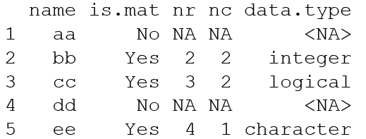

```{r setup, include=FALSE}
knitr::opts_chunk$set(echo = TRUE)
```

###Module 6 Exercise

- Design a for loop which analyzes a list of various data types and characterizes the elements in a data frame

- Sample data:
  - aa=c(3.4,1)
  - bb=matrix(1:4,2,2), 
  - cc=matrix(c(T,T,F,T,F,F),3,2),
  - dd="string here",  
  - ee=matrix(c("red","green","blue","yellow"))

- Preallocate the data frame elements where possible

- Output:




```{r}

```