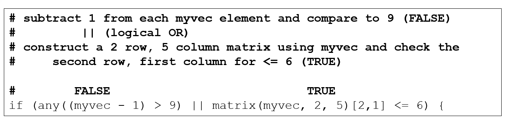
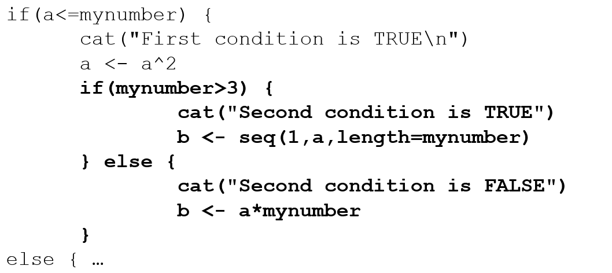
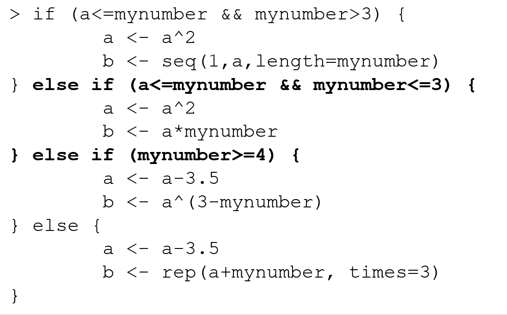

```{r rmarkdown-setup, echo = FALSE}
knitr::opts_chunk$set(warning = FALSE)
knitr::opts_chunk$set(message = FALSE)
```

## Day 2 Module 6

### Conditions and Loops

- The **if** statement allows for conditional execution of code

```{r}
a <- 3
myNumber <- 4
if (a <= myNumber) {   # end of line brace style
         a <- a^2
         print('modifying a')
}

if (a <= myNumber) 
{   # next line brace style
         a <- a^2
         print('modifying a')
}
```

-- end of line or next line brace style is acceptable but be consistent


- For a single-line if statement body, braces are not required, but it doesn't hurt to use them anyway
  - Using them can prevent subsequent defects when code is added to the body later
  
```{r}
a <- 3
myNumber <- 4
if (a <= myNumber) # this works
     a <- a^2

if (a <= myNumber) { # but this is recommended
     a <- a^2
}
```

- Conditions in if statements may be relational or logical expressions

```{r}
myvec <- c(2.73, 5.40, 2.15, 5.29, 1.36, 2.16, 1.41, 6.97, 7.99, 9.52)
mymatrix <- matrix(c(2,0,1,2,3,0,3,0,1,1), nrow=5, ncol=2)
myvec
mymatrix

if (any((myvec - 1) > 9) || matrix(myvec, 2, 5)[2,1] <= 6) {
    new.myvec <- myvec
    new.myvec[seq(1,9,2)] <- NA
    mylist <- list(aa=new.myvec, bb=mymatrix + 0.05)
    cat("new list:\n")
    mylist
}
```



- Else statements provide an alternative path for code to follow if an if condition is FALSE

- if (condition) {
-     # statements executed if condition is true
- } else {
-     # statements executed if condition is false
- }

```{r}
a <- 5
myNumber <- 4
if (a <= myNumber) {
      a <- a^2
} else {
      a <- a - 3.5
}
a
```

### Limitations of if in R

- An if statement can check the condition of only **a single logical value**.
  - If you pass in a vector of logicals for the condition, the if statement will only check the very first element and a warning is displayed, e.g.

```{r}
if (c(FALSE,TRUE,FALSE,TRUE,TRUE))  { }
```

- displays
  - Warning message:
  - In if (c(FALSE, TRUE, FALSE, TRUE, TRUE)) { :
  - the condition has length > 1 and only the first element will be used
  
### ifelse for Logical Vectors

- **Description**
- ifelse returns a value with the same shape as test which is filled with elements selected from either yes or no depending on whether the element of test is TRUE or FALSE.
- **Usage**
- ifelse(test, yes, no)
- **Arguments**
- test	
  - an object which can be coerced to a logical value
- yes	
  - return values for true elements of test.
- no	
  - return values for false elements of test.

```{r}
x <- 5
y <- -5:5
y
result <- ifelse(test= y == 0, yes = NA, no = x)
result
```

- An if statement can be placed within another if statement



- If statements can be sequentially stacked



### The Switch Statement

- switch() provides an alternative to complex stacked sequences

```{r}
mystring="Bart"

foo <- switch(EXPR=mystring, 
           Homer=12,
           Marge=34,
           Bart=56,
           Lisa=78,
           Maggie=90,
           NA
         )
foo

# is equivalent to

if(mystring=="Homer") {
      foo <- 12
} else if(mystring=="Marge") {
      foo <- 34
} else if(mystring=="Bart") {
      foo <- 56
} else if(mystring=="Lisa") {
      foo <- 78
} else if(mystring=="Maggie") {
      foo <- 90
} else {
      foo <- NA
}
foo
```

### For Loops

- The for loop iterates through elements in an object

```{r}
for(myitem in 5:7) {
  cat("the current item is",myitem,"\n")
}
```

- Vector elements in a for loop can be accessed by a variable named in the loop header or by an index

```{r}
# the following examples are equivalent:
myvec <- c(0.4,1.1,0.34,0.55)
for(i in myvec) {
    print(2 * i)
}

for(i in 1:length(myvec)) {
    print(2 * myvec[i])
}
```

- Preallocating output objects makes loop processing much more efficient
  - Time the following operations and compare their performance

```{r}
system.time({
  output <- rep(NA, 10000000);  # preallocate output object
  for (i in 1:10000000) {
    output[i] <- i + 1
  }
})

system.time({
  output <- NA;                 # dynamically resize output object
  for (i in 1:10000000) {
    output[i] <- i + 1
  }
})
```

- For loops can be nested
  - Align/indent for readability
  - Variable used in header must be unique

```{r}
loopvec1 <- c(1, 2, 3)
loopvec2 <- c(5, 10, 15)
result <- NULL
count <- 1
for (i in 1:length(loopvec1)) {
    for (j in 1:length(loopvec2)) {
        result[count] <- loopvec1[i]*loopvec2[j]
        count <- count + 1
    }
}
result
```

### While and Repeat Loops

- The while loop runs code while a certain condition remains TRUE

  - while (condition) {
    - code
  - }
  
```{r}
i <- 1
while (i < 6) {
  print(i)
  i <- i + 1
}
```

- The repeat loop will run code until the Escape key is pressed or the code encounters a break command

  - repeat {
    - code
    - if (condition) {
      - break
    - }
  - }

```{r}
x <- 1
# Repeat loop
repeat {
    print(x)
    
    # break statement to terminate if x > 4
    # comment out for infinite version, 
    # <Esc> required to terminate
    if (x > 4) {
        break
    } 
    
    # Increment x by 1
    x <- x + 1
}
```
