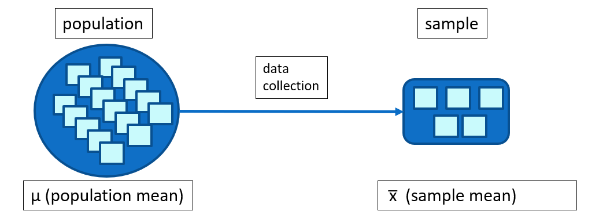
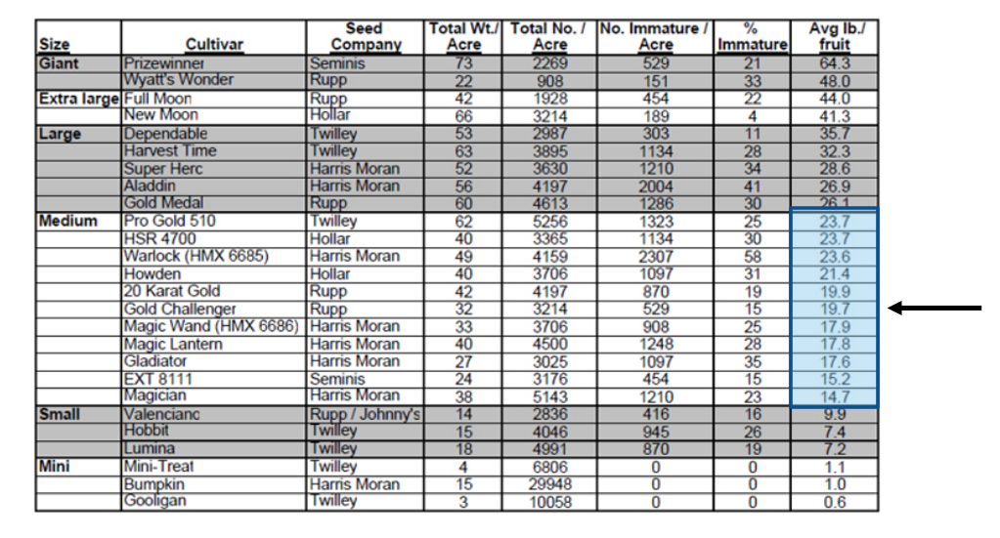

```{r rmarkdown-setup, echo = FALSE}
knitr::opts_chunk$set(warning = FALSE)
knitr::opts_chunk$set(message = FALSE)
```

## Day 2 Module 7

## Basic Statistics in R

### Numeric Variables

-   There are two basic types of numeric variables in statistics:
    -   **continuous** variables: any value in some interval, up to any number
        of decimals - (which technically gives an infinite number of possible
        values) e.g.
        -   1.1, -3.0, 1678.5323
    -   **discrete** variables: only distinct numeric values
        -   If the range is restricted, then the number of possible values is
            finite
        -   e.g. 1, -27, 101, 3108

### Univariate and Multivariate Data

-   **Univariate** data refers to the use of a single relevant variable
    -   e.g. the weight of a car
-   **Multivariate** data consist of multiple variables, where their individual
    components aren't useful in a particular statistical analysis
    -   Bivariate is sometimes considered a sub-category of multivariate,
        referring specifically to two variables considered together, but can
        also considered distinct from a multivariate analysis which requires
        three or more variables
    -   Bivariate can be easily plotted on an x- and y- axis
    -   Multivariate depends on analysis context
        -   e.g. an analysis requires height and weight as dependent variables
        -   e.g. a geographic location measured in three dimensions (latitude,
            longitude, and altitude)

### Parameters vs. Statistics

-   Statistics as a discipline is concerned with understanding features of an
    entire collection of individuals or entities of interest, known as a
    **population**
    -   Parameters are the characteristics of a population (e.g. **μ** -- the
        **population** mean)
-   Researchers typically collect a **sample** of data **to represent a
    population** and use models to derive relevant information from that data
    -   Statistics are characteristics of the sample: **estimated** parameters
        derived from the sample (e.g. **x-bar** -- the **sample** mean)



### Summary Statistics

-   Measurements which summarize data include -Centrality: describe how large
    collections of data are centered
    -   e.g. mean, median, mode
    -   Range, Variance, Standard Deviation
        -   measure the spread of the data
    -   Counts, Percentages, and Proportions
        -   useful for categorical data
    -   Quantiles, Percentiles, and the Five-Number Summary
        -   describe the distribution of a dataset
    -   Covariance and Correlation
        -   demonstrate the relationship between two variables
-   Given the weight (in lbs) for various pumpkin samples in the "Medium" size
    category, use R to calculate various summary data values



<http://vegetables.tennessee.edu/Pumpkin/pumpkin2007_1.html>
(note: this link is now broken :( )

```{r}
weights <- c(23.7,23.7,23.6,21.4,19.9,19.7,
            17.9,17.8,17.6,15.2,14.7)
meanw <- mean(weights)    # mean
medw <- median(weights)   # median
cat("mean=", meanw, "median=", medw, "\n")
sd(weights)    # standard deviation
range <- max(weights) - min(weights)  # range
range
```

- R has no statistical  "mode" function 
  - mode() in R is not the same (look it up)
  - A custom mode function can be written, many examples are available on the web
  - They all work in a similar fashion:
    - create a vector of unique values
    - count the number of indices for each unique value
    - get the element value of the maximum of the index with the highest count

```{r}
getmode <- function(v) {
  uv <- unique(v)
  uv[which.max(tabulate(match(v, uv)))]
}
getmode(weights)
```

### The tapply Function

- In calculating simple summary statistics, the R tapply function ('t' stands for 'table') can be used to compute statistics grouped by a specific categorical variable.
  - e.g. calculate the mean miles per gallon (mpg) for each cylinder value in the mtcars dataset

```{r}
tapply(mtcars$mpg,INDEX=mtcars$cyl,FUN=mean)
```

- use tapply on the pumpkin data

```{r}
# read the data
setwd("d:/fscj/WorkingConnections/WWC22-R/WWC2022/workbooks/day2")
pumpkin <- read.csv("pumpkin.csv")
# set the column names
names(pumpkin) <- c("Size","Num_Immature_Acre",
                    "Percent_Immature","Avg_lb")
# find the mean per size cateogory
result <- tapply(pumpkin$Avg_lb,INDEX=pumpkin$Size,FUN=mean)
# it's alphabetical, sort it numerically
sort(result,decreasing=TRUE)
# use the custom getmode function to find the mode per size category 
result <- tapply(pumpkin$Avg_lb,INDEX=pumpkin$Size,FUN=getmode)
# sort it
sort(result,decreasing=TRUE)
```