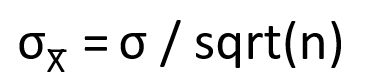

```{r rmarkdown-setup, echo = FALSE}
knitr::opts_chunk$set(warning = FALSE)
knitr::opts_chunk$set(message = FALSE)
```

## Day 2 Module 8

## Advanced Statistics in R

### Sampling Distributions and Confidence

-   A **sampling distribution** is a probability distribution that accounts for
    variability when population parameters are estimated using sample
    statistics.

    -   Modeling variability in an estimated sample statistic is a key part of
        many statistical analyses.

-   The sampling mean ("X-bar") is calculated using a smaller number of
    observations, so variability can decrease compared to a population mean.

-   The sampling standard deviation is referred to as the **standard error**
    ("sigma-X-bar") reflecting the fact that the probabilities are calculated
    from a sample.

-   The formulas for sampling distributions depend upon the probability
    distributions that generated the raw data, availability of measures of the
    population mean and standard deviation, and the size of the sample itself.

-   The formula to calculate the standard error for a sample distribution of
    size n given a known standard deviation σ is



### Normal Distributions

- Normal distributions follow a bell-curve, with consistent percentages of the
 data falling within (plus or minus) 1, 2 and 3 standard deviations of the mean.

### R Functions for Normal Distributions

```{r}
?Normal
```


Sample Distribution Example:

- Suppose that the daily maximum temperature in the month of January in Dunedin, New Zealand, follows a normal distribution, with a mean of 22 degrees Celsius and a standard deviation of 1.5 degrees
    - What is the probability that a randomly chosen day in January has a maximum temperature of less than 21.5 degrees?
    - What is the probability if the day is chosen from a random sampling of 5 days? (n = 5)

```{r}
# Pr(X < 21.5)          /// population
pnorm(21.5, mean=22, sd=1.5)

# Pr(Xbar < 21.5)       /// sample
pnorm(21.5, mean=22, sd=1.5/sqrt(5))
```

